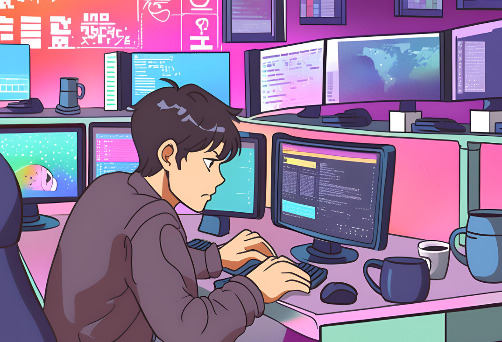

  

<h3 align="center">
  Software Engineer • Full-Stack Developer
</h3>

 

## &nbsp;My Stack

## About me

-  Hi everyone! I am David and I am a software engineer from Brazil..  
-  My current goal is become a Software Architect. 
-  My main stack is PHP with JavaScript, TypeScript, React and NodeJs. 

## Contact me

	
	

